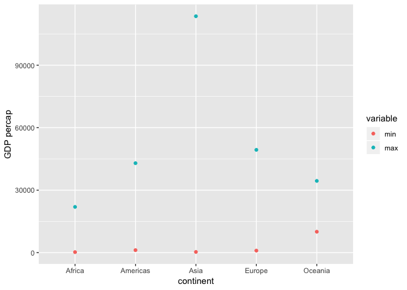
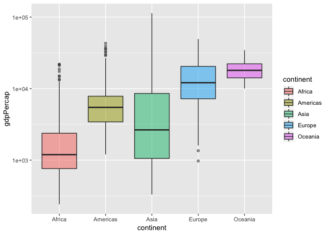
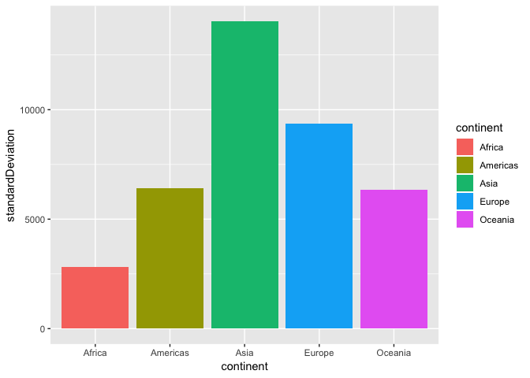
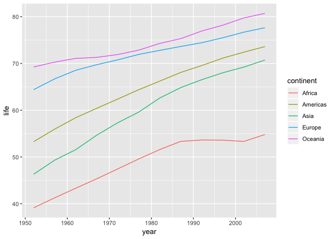
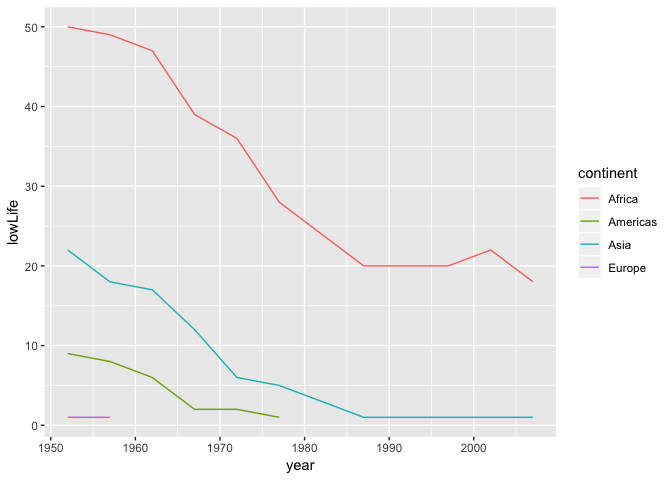

hw03\_gapminder
================
Liming Liu
2018-09-26

## Use dplyr/ggplot2 to manipulate and explore data

``` r
library(gapminder)
library(knitr)
library(kableExtra)
library(tidyverse)
```

    ## ── Attaching packages ────────────────────────────────────────────────────────────────────────────── tidyverse 1.2.1 ──

    ## ✔ ggplot2 3.0.0     ✔ purrr   0.2.5
    ## ✔ tibble  1.4.2     ✔ dplyr   0.7.6
    ## ✔ tidyr   0.8.1     ✔ stringr 1.3.1
    ## ✔ readr   1.1.1     ✔ forcats 0.3.0

    ## ── Conflicts ───────────────────────────────────────────────────────────────────────────────── tidyverse_conflicts() ──
    ## ✖ dplyr::filter() masks stats::filter()
    ## ✖ dplyr::lag()    masks stats::lag()

``` r
library(reshape2)
```

    ## 
    ## Attaching package: 'reshape2'

    ## The following object is masked from 'package:tidyr':
    ## 
    ##     smiths

#### 1\. Get the maximum and minimum of GDP per capital for all continents.

``` r
GDP <- gapminder %>% 
  group_by(continent) %>% 
  summarise(min = min(gdpPercap), max = max(gdpPercap))
GDP
```

    ## # A tibble: 5 x 3
    ##   continent    min     max
    ##   <fct>      <dbl>   <dbl>
    ## 1 Africa      241.  21951.
    ## 2 Americas   1202.  42952.
    ## 3 Asia        331  113523.
    ## 4 Europe      974.  49357.
    ## 5 Oceania   10040.  34435.

In order to plot two sets of data in one plot, use melt to get a long
format

``` r
gdp2 = melt(GDP, id="continent")
gdp2 %>% 
  ggplot(aes(continent,value, color = variable)) + geom_point() + ylab("GDP percap")
```

<!-- -->

#### 2\. Look at the spread of GDP per capita within the continents.

``` r
df1 <- gapminder %>% 
  group_by(continent) %>% 
  summarise(Q25 = quantile(gdpPercap,0.25), Q50 = quantile(gdpPercap, 0.5), Q75 = quantile(gdpPercap, 0.75), standardDeviation = sd(gdpPercap))
df1
```

    ## # A tibble: 5 x 5
    ##   continent    Q25    Q50    Q75 standardDeviation
    ##   <fct>      <dbl>  <dbl>  <dbl>             <dbl>
    ## 1 Africa      761.  1192.  2377.             2828.
    ## 2 Americas   3428.  5466.  7830.             6397.
    ## 3 Asia       1057.  2647.  8549.            14045.
    ## 4 Europe     7213. 12082. 20461.             9355.
    ## 5 Oceania   14142. 17983. 22214.             6359.

Get the box plot of the spread

``` r
gapminder %>% 
  ggplot(aes(continent, gdpPercap)) + scale_y_log10() + geom_boxplot(aes(fill = continent),alpha = 0.5)
```

<!-- -->

Get a bar graph of the standard deviation, must use stat=“identity” in
geom\_bar

``` r
df1 %>% 
  ggplot(aes(continent, standardDeviation, fill = continent)) + geom_bar(stat="identity")
```

<!-- -->

#### 3\. How is life expectancy changing over time on different continents?

``` r
df2 <- gapminder %>% 
  group_by(continent, year) %>% 
  summarise(life = mean(lifeExp))
df2
```

    ## # A tibble: 60 x 3
    ## # Groups:   continent [?]
    ##    continent  year  life
    ##    <fct>     <int> <dbl>
    ##  1 Africa     1952  39.1
    ##  2 Africa     1957  41.3
    ##  3 Africa     1962  43.3
    ##  4 Africa     1967  45.3
    ##  5 Africa     1972  47.5
    ##  6 Africa     1977  49.6
    ##  7 Africa     1982  51.6
    ##  8 Africa     1987  53.3
    ##  9 Africa     1992  53.6
    ## 10 Africa     1997  53.6
    ## # ... with 50 more rows

get the line plot of the lifeExp
trend

``` r
ggplot(df2, aes(year, life)) + geom_line(aes(group = continent,color = continent))
```

<!-- -->

#### 4\. Report the absolute and/or relative abundance of countries with low life expectancy over time by continent: Compute some measure of worldwide life expectancy – you decide – a mean or median or some other quantile or perhaps your current age. Then determine how many countries on each continent have a life expectancy less than this benchmark, for each year.

Set the benchmark to 50 years old

``` r
df3 <- gapminder %>% 
  filter(lifeExp < 50) %>% 
  group_by(year, continent) %>%
  summarise(lowLife = n())
df3
```

    ## # A tibble: 32 x 3
    ## # Groups:   year [?]
    ##     year continent lowLife
    ##    <int> <fct>       <int>
    ##  1  1952 Africa         50
    ##  2  1952 Americas        9
    ##  3  1952 Asia           22
    ##  4  1952 Europe          1
    ##  5  1957 Africa         49
    ##  6  1957 Americas        8
    ##  7  1957 Asia           18
    ##  8  1957 Europe          1
    ##  9  1962 Africa         47
    ## 10  1962 Americas        6
    ## # ... with 22 more rows

We can see there is no Oceania in the table above, check if the Oceania
lifeExp is all above 50:

``` r
gapminder %>% 
  filter(continent == "Oceania")
```

    ## # A tibble: 24 x 6
    ##    country   continent  year lifeExp      pop gdpPercap
    ##    <fct>     <fct>     <int>   <dbl>    <int>     <dbl>
    ##  1 Australia Oceania    1952    69.1  8691212    10040.
    ##  2 Australia Oceania    1957    70.3  9712569    10950.
    ##  3 Australia Oceania    1962    70.9 10794968    12217.
    ##  4 Australia Oceania    1967    71.1 11872264    14526.
    ##  5 Australia Oceania    1972    71.9 13177000    16789.
    ##  6 Australia Oceania    1977    73.5 14074100    18334.
    ##  7 Australia Oceania    1982    74.7 15184200    19477.
    ##  8 Australia Oceania    1987    76.3 16257249    21889.
    ##  9 Australia Oceania    1992    77.6 17481977    23425.
    ## 10 Australia Oceania    1997    78.8 18565243    26998.
    ## # ... with 14 more rows

So Oceania has no low lifeExp country through these years, the results
in the table is correct.

Get the line graph of low lifeExp number in each continent

``` r
df3 %>% 
  ggplot(aes(year, lowLife)) + geom_line(aes(group = continent, color = continent))
```

<!-- -->
